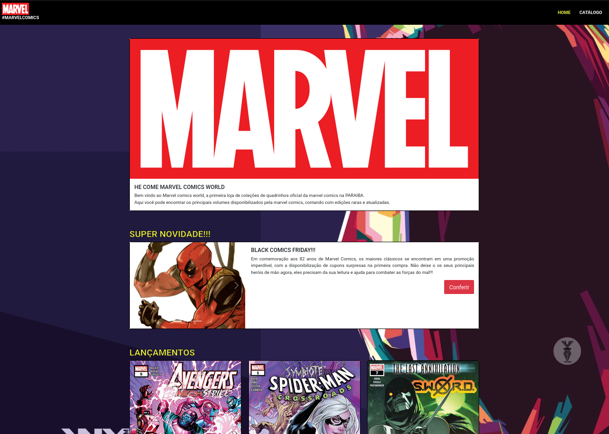

<div>
  <h1 align="center">MARVEL_WORD</h1>
  
  <div align="center">

  <a href="#sobre">Sobre</a> 
    |
  <a href="#tecnologias">Tecnólogias</a>
    |
  <a href="#dependencias">Dependências</a>
    |
  <a href="#Projeto">Pagina do projeto</a>

  </div>
</div>

<div >
<ul align="center">
  
  
  
  
  
  
</ul>

</div>


<div>
  <h3>Sobre.</h3>
  <h4 id="sobre" > Projeto com ideia de construir uma aplicação de commerce de quadrinho marvel, onde é possível ver as principais histórias do universo marvel. </h4>

  
  
  
  
  
</div>


<div id="tecnologias">
  <h3>Tecnológias.</h3>
  <ul>
      <li>
      <a href="https://www.typescriptlang.org/">TypeScript.
      </a>
    </li>
    <li>
      <a href="https://developer.mozilla.org/pt-BR/docs/Web/JavaScript">JavaScript.
      </a>
    </li>
    <li>
      <a href="https://developer.mozilla.org/pt-BR/docs/Web/CSS">CSS3.
      </a>
    </li>
    <li>
      <a href="https://developer.mozilla.org/pt-BR/docs/Web/HTML/HTML5">HTML5.
      </a>
    </li>
    <li>
      <a href="https://angular.io/">ANGULAR.
      </a>
    </li>
    <li>
      <a href="https://nodejs.org/pt-br/docs/">
        NODE.JS.
      </a>
    </li>
    <li>
      <a href="https://www.npmjs.com/package/ngx-toastr">
       ngx-toastr.
      </a>
    </li>
    <li>
      <a href="https://getbootstrap.com/">
        Bootstrap.
      </a>
    </li>

  </ul>
  
</div>

<div id="dependencias">
  <h3>Dependências.</h3>
    <p align="center">
      para utilizar da aplicação, será necessário fazer alguns procedimentos de instalação de pacotes
    </p>

```bash
# Clone this repository
$ git clone https://github.com/FullBarbosa/desafioMArvel.git MARVEL_WORD

# Install dependencies Yarn
$ yarn install

# Install dependencies NPM
$ npm install 

```
</div>

 <h3> 🚧 PROJETOS FUTUROS 🚧 </h3>
 <h4> Devido a falta de tempo relacionada a administração de trabalho com projeto pessoais algumas pendencias ainda ficaram evidente.</h4>

 <h5>O primeiro objetivo se encontra-se em gerar um valor random para as revistas raras, onde seria de 12% do catalogo exposto, na primeira versão só sendo possível ter 1% ou uma única revista com o tipo raro catalogado.</h5>

  <h5>Segunda proposta é desenvolver alguma forma de cupom, onde que seja feito um desconto com relação a sua raridade .</h5>

  <h5>Por ultimo objetivo, pela falta de experiência com angular, a performance ficou a desejar...algo a se trabalhar em futuras versões</h5>

  <h5> Pendencia Extra: Desenvolver em React e React-Native utilizando a minha principal stack e versões nativas</h5>


<h3>Deploy da aplicação</h3>  
    <a href="https://desafio-ma-rvel.vercel.app/home">
    
    </a>
